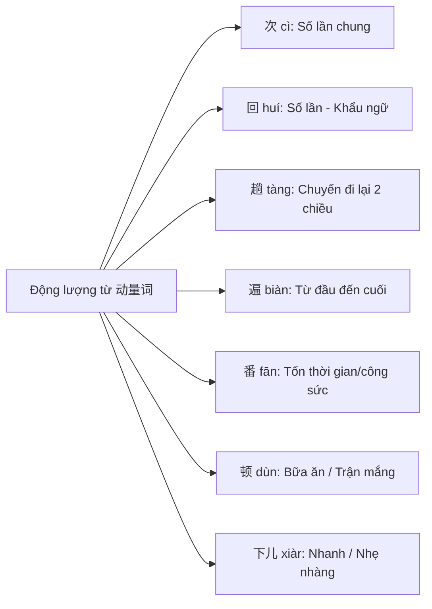
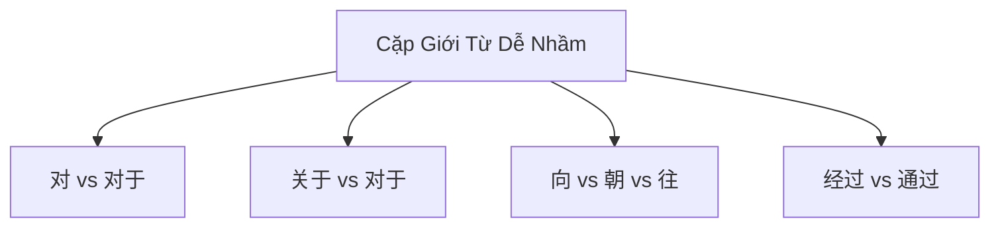
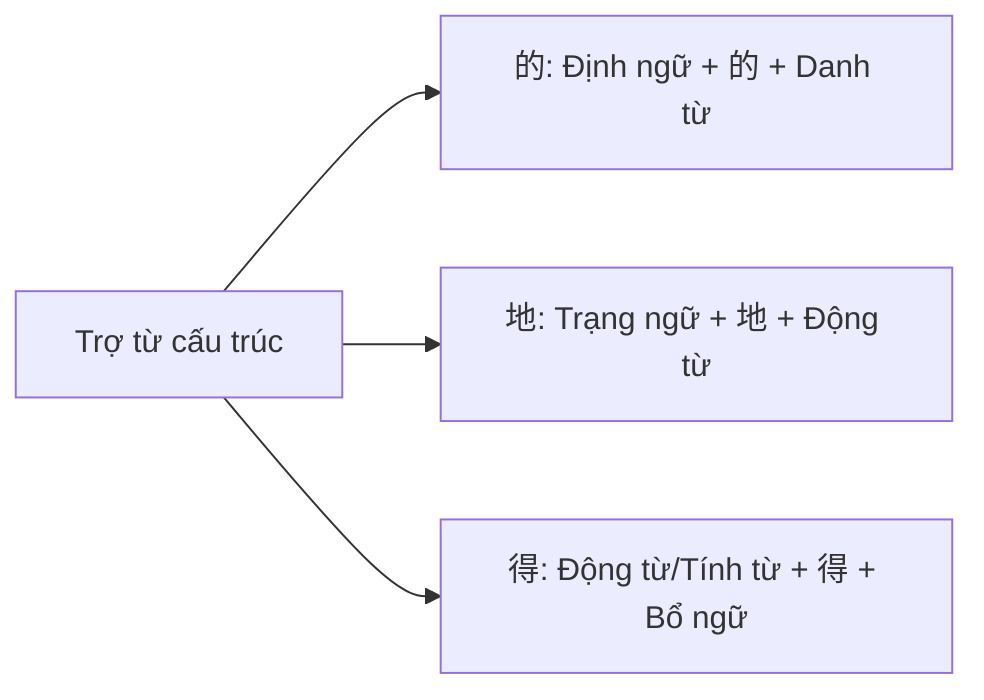

# GIÁO TRÌNH NGỮ PHÁP HSK TINH GIẢNG (精讲精练)
## TÀI LIỆU BIÊN SOẠN BẢN QUYỀN THEO CHUẨN SÁCH 《HSK 语法精讲精练》 (ZHANG JING)

---

> **Mục tiêu giáo trình**: Giúp học viên làm chủ 100% các điểm ngữ pháp trọng tâm HSK 3 - HSK 5, nhận biết bẫy đề thi, nâng cao phản xạ phân tích câu và đạt điểm tuyệt đối phần Kiến thức Ngữ pháp HSK.
> **Cấu trúc mỗi bài học (5 bước chuẩn khoa học)**:
> 1. 🎯 **Mục tiêu bài học** (Learning Objectives)
> 2. 💡 **Kiến thức trọng tâm & Điểm thi HSK** (Examination Points & Formulas)
> 3. ⚡ **Phân biệt ngữ pháp & Lỗi sai hay gặp** (Confusing Points & Common Pitfalls)
> 4. 📝 **Bài tập luyện thi HSK mô phỏng** (Practice Exercises)
> 5. 🔑 **Đáp án & Giải thích chi tiết** (Detailed Answers & Explanations)

---

## 📊 BẢNG MA TRẬN KIẾN THỨC 11 BÀI HỌC NGỮ PHÁP HSK

| Bài số | Chủ đề Ngữ pháp | Điểm cốt lõi & Cấu trúc trọng tâm | Mức độ thi HSK |
| :---: | :--- | :--- | :---: |
| **Bài 1** | **量词 (Lượng từ)** | Danh lượng từ, Động lượng từ, Quy tắc bớt "一", Lượng từ mượn từ danh từ, Bảng 60+ lượng từ chuẩn HSK | HSK 3 - 5 |
| **Bài 2** | **副词 (Phó từ)** | Phó từ thời gian, phạm vi, mức độ, ngữ khí, tần suất; Phân biệt 15+ cặp phó từ đồng nghĩa dễ nhầm | HSK 3 - 5 |
| **Bài 3** | **介词 (Giới từ)** | Giới từ thời gian, nơi chốn, đối tượng, căn cứ; Phân biệt `对/对于`, `关于/对于`, `按/按照/凭`, `经过/通过` | HSK 3 - 5 |
| **Bài 4** | **连词 (Liên từ)** | Liên từ nối từ/cụm từ & vế câu; Phân biệt `和/与/及/以及`, `还是/或者`, `并/并且`, `而` | HSK 3 - 5 |
| **Bài 5** | **助词 (Trợ từ)** | Trợ từ cấu trúc `的/地/得`, Trợ từ động thái `了/着/过`, Trợ từ ngữ khí `啊/吧/呢/吗/了` | HSK 3 - 5 |
| **Bài 6** | **能愿动词 (Động từ năng nguyện)** | Ý nguyện (`要/想/愿意/敢/肯`), Khả năng (`能/能够/可以/会`), Sự cần thiết (`应该/必须/得`); Dạng phủ định | HSK 3 - 5 |
| **Bài 7** | **重叠 (Hình thức trùng điệp)** | Trùng điệp động từ (`AA/A一A/A了A/ABAB`), tính từ (`AA/AABB/ABB`), danh từ/lượng từ (`天天/件件`) | HSK 3 - 5 |
| **Bài 8** | **常见句式 (Các mẫu câu thường gặp)** | Câu chữ 把 (`把字句`), Câu chữ 被 (`被字句`), Câu so sánh (`比/有/像`), Câu tồn tại (`存现句`), Câu kiêm ngữ | HSK 3 - 5 |
| **Bài 9** | **补语 (Bổ ngữ)** | Bổ ngữ kết quả, Bổ ngữ xu hướng (đơn/kép), Bổ ngữ khả năng, Bổ ngữ trình độ/trạng thái, Bổ ngữ thời lượng | HSK 3 - 5 |
| **Bài 10**| **关联词与复句 (Từ nối & Câu phức)** | 8 Nhóm câu phức: Song song, Tiệm tiến, Chuyển折, Nhân quả, Giả định, Điều kiện, Lựa chọn, Nhượng bộ | HSK 3 - 5 |
| **Bài 11**| **语序 (Trật tự từ trong câu)** | Trật tự câu tổng quát `[S] + [Adv] + [V] + [C] + [O]`, Vị trí Định ngữ nhiều tầng & Trạng ngữ nhiều tầng | HSK 3 - 5 |
| **Phụ lục**| **HSK 真题 语法结构** | Bộ đề thi mô phỏng HSK tổng hợp 30 câu chuẩn form thi kèm đáp án & phân tích chi tiết từng câu | HSK 3 - 5 |

---

# BÀI 1: LƯỢNG TỪ (量词 - QUANTIFIERS)

## 🎯 1. MỤC TIÊU BÀI HỌC
- Nắm vững công thức kết hợp của **Danh lượng từ (名量词)** và **Động lượng từ (动量词)**.
- Thành thạo 60+ danh lượng từ thông dụng xuất hiện liên tục trong đề thi HSK.
- Phân biệt chính xác cách dùng của các động lượng từ chỉ số lần hành động: `次`, `回`, `趟`, `遍`, `番`, `顿`, `下儿`.
- Nhận biết các hiện tượng ngữ pháp đặc biệt: Noun dùng làm lượng từ (名词 borrow as quantifier) và lược bỏ số词 "一" trong khẩu ngữ.

---

## 💡 2. KIẾN THỨC TRỌNG TÂM & ĐIỂM THI HSK (EXAMINATION POINTS)

### 2.1. Phân loại và Công thức chuẩn
| Phân loại | Công thức chuẩn | Giải thích & Ví dụ minh họa |
| :--- | :--- | :--- |
| **Danh lượng từ (名量词)** | `Số từ + Lượng từ + Danh từ` | Dùng để đo lường số lượng người, con vật, đồ vật. • 一本书 (yì běn shū): *1 quyển sách* • 一伙罪犯 (yì huǒ zuìfàn): *1 nhóm tội phạm* |
| **Động lượng từ (动量词)** | `Động từ + Số từ + Lượng từ` | Dùng để đo lường số lần/tần suất thực hiện hành động. • 看一遍 (kàn yí biàn): *xem 1 lượt từ đầu đến cuối* • 去一次 (qù yí cì): *đi 1 lần* |

### 2.2. Các đặc điểm ngữ pháp quan trọng
1. **Danh từ mượn làm lượng từ (名词用作量词)**:
   - Một số danh từ chỉ vật chứa có thể mượn làm lượng từ:
     - 一个抽屉 (cái ngăn kéo) ➔ **一抽屉书** (một ngăn kéo sách)
     - 一辆车 (chiếc xe) ➔ **一车人** (một xe người)
     - 一把刀 (con dao) ➔ **切了一刀** (cắt một dao)
     - 一只脚 (bàn chân) ➔ **踢了一脚** (đá một cái)

2. **Quy tắc lược bỏ số từ "一" (省略数词 "一")**:
   - Trong giao tiếp khẩu ngữ, khi số từ là "一" (và chỉ duy nhất là "一"), số từ "一" có thể được lược bỏ:
     - 借我**本**书，好吗？ (Cho tôi mượn [một] quyển sách được không?)
     - 我去看**个**朋友。 (Tôi đi thăm [một] người bạn.)
     - 你去**趟**他家吧。 (Bạn đi [một] chuyến đến nhà anh ấy đi.)

---

### 📊 BẢNG TRA CỨU 60+ DANH LƯỢNG TỪ CHUẨN HSK (COMMON NOUN QUANTIFIERS)

| Lượng từ | Danh từ kết hợp thường gặp (Matching Nouns) | Ví dụ & Nghĩa tiếng Việt |
| :---: | :--- | :--- |
| **把 (bǎ)** | 尺子, 勺子, 扇子, 剪子, 梳子, 椅子, 斧子, 刀, 锁, 伞, 钥匙, 牙刷, 梯子 | 一把伞 (*1 cây dù*), 一把椅子 (*1 cái ghế*) |
| **杯 (bēi)** | 水, 茶, 酒, 牛奶, 咖啡, 饮料 | 一杯水 (*1 ly nước*), 一杯咖啡 (*1 tách cà phê*) |
| **本 (běn)** | 书, 杂志, 画报, 小说, 字典, 词典 | 一本书 (*1 cuốn sách*), 一本词典 (*1 cuốn từ điển*) |
| **笔 (bǐ)** | 钱, 账, 生意, 财富, 收入, 花销, 开销 | 一笔钱 (*1 khoản tiền*), 一笔生意 (*1 thương vụ*) |
| **部 (bù)** | 机器, 电影, 词典, 手机, 著作 | 一部电影 (*1 bộ phim*), 一部手机 (*1 chiếc điện thoại*) |
| **场 (chǎng)** | 比赛, 电影, 大雨, 考试, 讨论, 灾难 | 一场比赛 (*1 trận đấu*), 一场大雨 (*1 trận mưa lớn*) |
| **册 (cè)** | 图书, 纪念册, 邮册 | 一册书 (*1 tập sách*) |
| **层 (céng)** | 楼, 台阶, 灰, 奶油, 意思 | 一层楼 (*1 tầng nhà*), 一层灰 (*1 lớp bụi*) |
| **滴 (dī)** | 水, 油, 汗, 血, 眼泪, 墨水 | 一滴眼泪 (*1 giọt nước mắt*), 一滴水 (*1 giọt nước*) |
| **顶 (dǐng)** | 帽子, 轿子, 帐篷 | 一顶帽子 (*1 chiếc mũ/nón*) |
| **堆 (duī)** | 东西, 草, 粮食, 土, 煤, 垃圾 | 一堆垃圾 (*1 đống rác*) |
| **队 (duì)** | 战士, 警察, 大雁 | 一队战士 (*1 đội chiến sĩ*) |
| **对 (duì)** | 夫妻, 恋人, 双胞胎, 鸳鸯, 翅膀, 花瓶, 耳环 | 一对夫妻 (*1 cặp vợ chồng*), 一对耳环 (*1 đôi bông tai*) |
| **朵 (duǒ)** | 花, 云 | 一朵花 (*1 bông hoa*), 一朵云 (*1 đám mây*) |
| **封 (fēng)** | 信, 电报, 邮件 | 一封信 (*1 lá thư*) |
| **幅 (fú)** | 画, 地图, 画像, 布 | 一幅画 (*1 bức tranh*), 一幅地图 (*1 tấm bản đồ*) |
| **根 (gēn)** | 针, 绳子, 棍子, 腰带, 竹子, 香蕉, 骨头, 头发 | 一根香蕉 (*1 quả chuối*), 一根绳子 (*1 sợi dây*) |
| **棵 (kē)** | 树, 草, 菜, 葱 | 一棵树 (*1 cái cây*) |
| **颗 (kē)** | 星星, 心, 宝石, 钻石, 牙齿, 种子, 子弹 | 一颗心 (*1 trái tim*), 一颗星星 (*1 ngôi sao*) |
| **块 (kuài)** | 钱, 糖, 面包, 蛋糕, 手表, 香皂, 黑板 | 一块手表 (*1 chiếc đồng hồ*), 一块面包 (*1 ổ bánh mì*) |
| **辆 (liàng)**| 车, 汽车, 出租车, 自行车, 摩托车 | 一辆自行车 (*1 chiếc xe đạp*) |
| **面 (miàn)**| 镜子, 旗帜, 鼓, 墙 | 一面镜子 (*1 tấm gương*), 一面旗帜 (*1 lá cờ*) |
| **门 (mén)** | 功课, 课程, 知识, 学科, 科学, 技术, 大炮 | 一门外语 (*1 môn ngoại ngữ*) |
| **匹 (pǐ)** | 马, 骆驼, 布, 绸缎 | 一匹马 (*1 con ngựa*) |
| **篇 (piān)**| 文章, 论文, 课文, 日记, 小说 | 一篇文章 (*1 bài văn/báo*) |
| **片 (piàn)**| 药, 肉, 面包, 树叶, 云, 草地 | 一片树叶 (*1 chiếc lá*) |
| **群 (qún)** | 人, 鸡, 羊, 鸭子, 蜜蜂, 学生 | 一群羊 (*1 đàn cừu*), 一群人 (*1 nhóm người*) |
| **首 (shǒu)**| 诗, 词, 歌, 乐曲 | 一首歌 (*1 bài hát*), 一首诗 (*1 bài thơ*) |
| **双 (shuāng)**| 手套, 鞋, 袜子, 筷子, 手, 脚 | 一双鞋 (*1 đôi giày*), 一双筷子 (*1 đôi đũa*) |
| **所 (suǒ)** | 医院, 学校, 幼儿园 | 一所学校 (*1 ngôi trường*) |
| **套 (tào)** | 家具, 图书, 衣服, 房子, 办法, 餐具 | 一套衣服 (*1 bộ quần áo*) |
| **条 (tiáo)** | 狗, 鱼, 蛇, 黄瓜, 毛巾, 路, 裙子, 裤子 | 一条鱼 (*1 con cá*), 一条路 (*1 con đường*) |
| **头 (tóu)** | 牛, 猪, 大象, 驴, 蒜 | 一头牛 (*1 con bò*), 一头大象 (*1 con voi*) |
| **项 (xiàng)**| 工作, 工程, 政策, 制度, 任务, 计划, 建议 | 一项任务 (*1 nhiệm vụ*), 一项计划 (*1 kế hoạch*) |
| **张 (zhāng)**| 纸, 报, 画, 票, 照片, 卡片, 床, 桌子, 脸 | 一张照片 (*1 tấm ảnh*), 一张桌子 (*1 cái bàn*) |
| **支 (zhī)** | 笔, 枪, 箭, 队伍, 曲子 | 一支笔 (*1 cây viết/bút*) |
| **只 (zhī)** | 眼睛, 耳朵, 鸟, 猫, 狗, 羊, 船, 手套 (1 chiếc) | 一只猫 (*1 con mèo*), 一只手 (*1 bàn tay*) |
| **座 (zuò)** | 山, 桥, 楼, 塔, 宫殿, 城市, 雕塑 | 一座山 (*1 ngọn núi*), 一座桥 (*1 cây cầu*) |

---

## ⚡ 3. PHÂN BIỆT NGỮ PHÁP & LỖI SAI HAY GẶP (CONFUSING POINTS)

### Phân biệt 7 Động lượng từ chỉ số lần hành động (Verb Quantifiers)

1. **次 (cì)**: Dùng phổ biến nhất, biểu thị số lần xảy ra của hành động chung.
   - Ví dụ: 我去过**一次**北京。 (*Tôi từng đi Bắc Kinh 1 lần.*)
2. **回 (huí)**: Biểu thị số lần hành động, dùng nhiều trong khẩu ngữ (tương đương 次).
   - Ví dụ: 我跟他见过**一回**。 (*Tôi từng gặp anh ấy 1 lần.*)
3. **趟 (tàng)**: Đi kèm với các động từ di chuyển (去, 来, 跑, 走), biểu thị **chuyến đi lại hai chiều (lượt đi và về)**.
   - Ví dụ: 我去**一趟**邮局。 (*Tôi đi [một chuyến] ra bưu điện rồi về.*)
4. **遍 (biàn)**: Biểu thị quá trình hành động thực hiện **từ đầu đến cuối (từ trang đầu đến trang cuối, từ chữ đầu đến chữ cuối)**.
   - Ví dụ: 这本书我看过两**遍**。 (*Quyển sách này tôi đã đọc 2 lần [từ đầu đến cuối].*)
5. **番 (fān)**: Biểu thị hành động tốn nhiều thời gian, công sức, trí tuệ. **Số từ chỉ đi với "一" (一番)**.
   - Ví dụ: 经过**一番**努力，他终于成功了。 (*Trải qua một hồi nỗ lực, anh ấy cuối cùng đã thành công.*)
6. **顿 (dùn)**: Dùng cho bữa ăn (吃饭), mắng chửi (骂), đánh đập (打), khuyên bảo (批评).
   - Ví dụ: 挨了一**顿**骂。 (*Bị mắng cho một trận.*) / 一日三**顿**饭。 (*Một ngày 3 bữa cơm.*)
7. **下儿 (xiàr)**: Biểu thị hành động diễn ra nhanh, thời gian ngắn, hoặc thể hiện ngữ khí nhẹ nhàng, thoải mái.
   - Ví dụ: 请敲**一下儿**门。 (*Xin hãy gõ cửa một cái.*) / 敲了**两下**。 (*Gõ 2 cái.*)

---

## 📝 4. BÀI TẬP LUYỆN THI HSK MÔ PHỎNG (PRACTICE EXERCISES)

**Chọn lượng từ chính xác nhất điền vào chỗ trống (A, B, C, D):**

1. 妈妈慢慢睁开眼，看了我一_______，又闭上了。  
   A. 面 &nbsp;&nbsp;&nbsp;&nbsp; B. 眼 &nbsp;&nbsp;&nbsp;&nbsp; C. 道 &nbsp;&nbsp;&nbsp;&nbsp; D. 趟

2. 操场上，一_______学生在打篮球。  
   A. 伙 &nbsp;&nbsp;&nbsp;&nbsp; B. 群 &nbsp;&nbsp;&nbsp;&nbsp; C. 批 &nbsp;&nbsp;&nbsp;&nbsp; D. 层

3. 她真聪明，这首歌她只听了一_______就会唱了。  
   A. 下 &nbsp;&nbsp;&nbsp;&nbsp; B. 阵 &nbsp;&nbsp;&nbsp;&nbsp; C. 遍 &nbsp;&nbsp;&nbsp;&nbsp; D. 声

4. 这件衣服我买贵了，花了整整一_______钱。  
   A. 张 &nbsp;&nbsp;&nbsp;&nbsp; B. 笔 &nbsp;&nbsp;&nbsp;&nbsp; C. 件 &nbsp;&nbsp;&nbsp;&nbsp; D. 项

5. 颐和园真美，我去过一_______了，可还想再去。  
   A. 遍 &nbsp;&nbsp;&nbsp;&nbsp; B. 个 &nbsp;&nbsp;&nbsp;&nbsp; C. 次 &nbsp;&nbsp;&nbsp;&nbsp; D. 下

6. 小孟酷爱看报，每次都买七八_______报纸。  
   A. 本 &nbsp;&nbsp;&nbsp;&nbsp; B. 片 &nbsp;&nbsp;&nbsp;&nbsp; C. 份 &nbsp;&nbsp;&nbsp;&nbsp; D. 张

7. 小刘雄心勃勃，总想干出一_______轰轰烈烈的大事业。  
   A. 番 &nbsp;&nbsp;&nbsp;&nbsp; B. 个 &nbsp;&nbsp;&nbsp;&nbsp; C. 项 &nbsp;&nbsp;&nbsp;&nbsp; D. 件

8. 这_______照片是我在张家界拍的。  
   A. 片 &nbsp;&nbsp;&nbsp;&nbsp; B. 张 &nbsp;&nbsp;&nbsp;&nbsp; C. 幅 &nbsp;&nbsp;&nbsp;&nbsp; D. 册

9. 中国乒乓球队一举夺得了五_______冠军。  
   A. 项 &nbsp;&nbsp;&nbsp;&nbsp; B. 个 &nbsp;&nbsp;&nbsp;&nbsp; C. 类 &nbsp;&nbsp;&nbsp;&nbsp; D. 种

10. 这两_______银杏树已经二百多岁了。  
    A. 棵 &nbsp;&nbsp;&nbsp;&nbsp; B. 颗 &nbsp;&nbsp;&nbsp;&nbsp; C. 条 &nbsp;&nbsp;&nbsp;&nbsp; D. 粒

---

## 🔑 5. ĐÁP ÁN & GIẢI THÍCH CHI TIẾT (ANSWERS & EXPLANATIONS)

1. **Đáp án B (眼)**  
   *Giải thích*: Danh từ bộ phận cơ thể "眼" (mắt) mượn làm động lượng từ. "看了我一眼" nghĩa là *nhìn tôi một cái*.
2. **Đáp án B (群)**  
   *Giải thích*: "群" là lượng từ tập hợp chỉ một nhóm người hoặc động vật tụ tập lại (*一群学生: một nhóm học sinh*). "伙" dùng cho nhóm người mang nghĩa tiêu cực (一伙罪犯), "批" dùng cho đợt/lô hàng hóa hoặc đợt người.
3. **Đáp án C (遍)**  
   *Giải thích*: "听了一遍" nhấn mạnh việc nghe trọn vẹn bài hát *từ đầu đến cuối*.
4. **Đáp án B (笔)**  
   *Giải thích*: Lượng từ "笔" đi với danh từ liên quan đến tiền bạc, tài chính (*一笔钱: một khoản tiền*, *一笔生意*).
5. **Đáp án C (次)**  
   *Giải thích*: "去过一次" chỉ số lần đến một địa điểm nói chung. (Không dùng 遍 vì đi du lịch không mang nghĩa nghe/đọc từ đầu đến cuối).
6. **Đáp án C (份)**  
   *Giải thích*: Lượng từ cho báo chí (报纸), tài liệu, hợp đồng là "份" (*七八份报纸*).
7. **Đáp án A (番)**  
   *Giải thích*: "干一番事业" (làm nên một sự nghiệp). Lượng từ "番" đi với công sức, sự nghiệp (事业), lòng thành (心意).
8. **Đáp án B (张)**  
   *Giải thích*: Lượng từ cho bức ảnh (照片), giấy tờ phẳng gập mở được là "张" (*一张照片*).
9. **Đáp án A (项)**  
   *Giải thích*: Lượng từ cho hạng mục thể thao, giải thưởng, chính sách, nhiệm vụ là "项" (*五项冠军: 5 danh hiệu vô địch*).
10. **Đáp án A (棵)**  
    *Giải thích*: Lượng từ cho cây cối (树, 草) là "棵" (bộ Mộc 木). Phân biệt với "颗" (bộ Hiệt 页) dùng cho vật nhỏ hình tròn/hạt như ngôi sao, trái tim, viên ngọc (心, 星星).

---
# BÀI 2: PHÓ TỪ (副词 - ADVERBS)

## 🎯 1. MỤC TIÊU BÀI HỌC
- Nắm vững vị trí cú pháp chuẩn của phó từ: Làm **trạng ngữ (状语)** đứng trước Động từ hoặc Tính từ.
- Phân loại 7 nhóm phó từ: Thời gian, Phạm vi, Mức độ, Ngữ khí, Tần suất, Phương thức, Phủ định.
- Làm chủ 15+ cặp phó từ gần nghĩa hay gây nhầm lẫn nhất trong bài thi HSK (辨析).

---

## 💡 2. KIẾN THỨC TRỌNG TÂM & ĐIỂM THI HSK (EXAMINATION POINTS)

### 2.1. Vị trí cú pháp & Phân loại phó từ
- **Công thức chuẩn**: `[Chủ ngữ] + [Phó từ (Trạng ngữ)] + [Động từ / Tính từ]`
- **Phân loại 7 nhóm phó từ**:
  1. **Thời gian (时间)**: 刚, 刚才, 已经, 曾经, 正在, 将要, 马上, 渐渐, 偶尔
  2. **Phạm vi (范围)**: 都, 全, 共, 一共, 只, 仅仅, 随, 几乎
  3. **Mức độ (程度)**: 很, 非常, 极, 极其, 顶, 太, 更, 更加, 越, 越发
  4. **Ngữ khí (语气)**: 居然, 竟然, 难道, 究竟, 到底, 倒, 却, 反而, 幸亏
  5. **Tần suất (频率)**: 再, 又, 也, 还, 屡次, 常常, 往往, 一直, 总是
  6. **Phương thức/Tình thái (情态方式)**: 互相, 亲自, 互相, 纷纷, 特意
  7. **Phủ định (否定)**: 不, 没, 没有, 未, 别, 莫

---

## ⚡ 3. PHÂN BIỆT NGỮ PHÁP & LỖI SAI HAY GẶP (CONFUSING POINTS)

### 1. Phân biệt `本来` (běnlái) vs `原来` (yuánlái)
- **Giống nhau**: Đều có thể làm phó từ biểu thị "vốn dĩ, ban đầu".
- **Khác nhau**:
  - `本来`: Nhấn mạnh tính lý do chính đáng hoặc lẽ tự nhiên (*Chủ nhật vốn dĩ nên nghỉ ngơi*).
  - `原来`: Có thêm nét nghĩa **"hóa ra là..."** (phát hiện ra sự thật mà trước đây không biết). Ngoài ra `原来` có thể làm Tính từ (*giao diện nguyên bản / người ban đầu*), còn `本来` thì không.
  - *Ví dụ*: **原来**是你啊！我没认出来。 (*Hóa ra là bạn à! Tôi không nhận ra.* ➔ KHÔNG dùng 本来).

### 2. Phân biệt `刚` (gāng) vs `刚才` (gāngcái)
- `刚` là **Phó từ**:
  - Đứng **sau chủ ngữ, trước động từ** (`S + 刚 + V`).
  - Không thể làm chủ ngữ, không đứng trước chủ ngữ.
  - Có thể kết hợp với từ chỉ thời gian (*刚来两天*).
- `刚才` là **Danh từ chỉ thời gian**:
  - Có thể đứng **trước hoặc sau chủ ngữ** (`刚才 + S + V` hoặc `S + 刚才 + V`).
  - Có thể kết hợp với từ phủ định `没` (*刚才我没说话*).

### 3. Phân biệt `几乎` (jīhū) vs `简直` (jiǎnzhí)
- `几乎` (suýt nữa, gần như): Nhấn mạnh mức độ tiệm cận 100%, thực tế chưa đạt tới (*Con đường này suýt nữa làm tôi lạc*).
- `简直` (quả là, hoàn toàn): Nhấn mạnh sự khoa trương, kinh ngạc (*Thời tiết này quả là nóng như lò luyện*).

### 4. Phân biệt `竟然` (jìngrán) vs `居然` (jūrán)
- Đều biểu thị sự bất ngờ, ngoài dự tính ("lại", "không ngờ").
- `居然`: Nhấn mạnh mức độ kinh ngạc cao hơn, thường dùng khi kết quả đạt được vượt qua độ khó cực kỳ lớn.
- `竟然`: Dùng rộng rãi hơn trong cả văn nói và văn viết.

### 5. Phân biệt `倒` (dào) vs `却` (què)
- `倒`: Ngược lại, thế mà. Mang ngữ khí uyển chuyển, có thể biểu thị ý chuyển hướng nhẹ nhàng, sự khen ngợi ngoài dự tính hoặc giải thích uất ức (*Bài hát này nghe倒挺好听: Bài này nghe thế mà lại hay đấy*).
- `却`: Nhấn mạnh sự đối lập, chuyển hướng rõ rệt và cứng hơn.

---

## 📝 4. BÀI TẬP LUYỆN THI HSK MÔ PHỎNG (PRACTICE EXERCISES)

1. 我去找过他几次，_______他都不在家。  
   A. 本来 &nbsp;&nbsp;&nbsp;&nbsp; B. 恰好 &nbsp;&nbsp;&nbsp;&nbsp; C. 偏偏 &nbsp;&nbsp;&nbsp;&nbsp; D. 几乎

2. 听说要开家长会，他_______紧张起来。  
   A. 顿时 &nbsp;&nbsp;&nbsp;&nbsp; B. 按时 &nbsp;&nbsp;&nbsp;&nbsp; C. 准时 &nbsp;&nbsp;&nbsp;&nbsp; D. 暂时

3. 这件事_______大家都有责任，不能全怪小李。  
   A. 果然 &nbsp;&nbsp;&nbsp;&nbsp; B. 显然 &nbsp;&nbsp;&nbsp;&nbsp; C. 居然 &nbsp;&nbsp;&nbsp;&nbsp; D. 竟然

4. 别看他平时不声不响，关键时刻_______挺有办法。  
   A. 倒 &nbsp;&nbsp;&nbsp;&nbsp; B. 却 &nbsp;&nbsp;&nbsp;&nbsp; C. 就 &nbsp;&nbsp;&nbsp;&nbsp; D. 才

5. 事情_______不像我们想象的那么复杂。  
   A. 根本 &nbsp;&nbsp;&nbsp;&nbsp; B. 基本 &nbsp;&nbsp;&nbsp;&nbsp; C. 必定 &nbsp;&nbsp;&nbsp;&nbsp; D. 必须

---

## 🔑 5. ĐÁP ÁN & GIẢI THÍCH CHI TIẾT (ANSWERS & EXPLANATIONS)

1. **Đáp án C (偏偏 - piānpiān)**  
   *Giải thích*: Phó từ "偏偏" (cố tình, trớ trêu thay) biểu thị ý sự việc xảy ra trái ngược hoàn toàn với mong muốn.
2. **Đáp án A (顿时 - dùnshí)**  
   *Giải thích*: Phó từ "顿时" (lập tức, ngột nhiên) dùng miêu tả phản ứng tâm lý/trạng thái diễn ra ngay tức khắc tại thời điểm đó.
3. **Đáp án B (显然 - xiǎnrán)**  
   *Giải thích*: "显然" (rõ ràng là) dùng để đưa ra nhận định mang tính hiển nhiên.
4. **Đáp án A (倒 - dào)**  
   *Giải thích*: "倒" biểu thị sự chuyển hướng có tính chất khen ngợi ngoài dự tính (*thế mà lại khá có cách*).
5. **Đáp án A (根本 - gēnběn)**  
   *Giải thích*: "根本 + 不/没" nghĩa là *căn bản không / hoàn toàn không*.

---
# BÀI 3: GIỚI TỪ (介词 - PREPOSITIONS)

## 🎯 1. MỤC TIÊU BÀI HỌC
- Nắm vững cấu trúc Giới từ: `Cụm giới từ (介词短语) = Giới từ + Tân ngữ`.
- Vị trí Cụm giới từ trong câu: Thường làm **Trạng ngữ** trước động từ, một số làm **Bổ ngữ** (như `在, 向, 往, 到`) hoặc **Định ngữ** (cần thêm `的`).
- Phân biệt 6 nhóm giới từ theo ý nghĩa và làm chủ các cặp giới từ dễ nhầm lẫn: `对/对于`, `关于/对于`, `按/按照/凭`, `经过/通过`.

---

## 💡 2. KIẾN THỨC TRỌNG TÂM & ĐIỂM THI HSK (EXAMINATION POINTS)

### 2.1. Phân loại 6 nhóm Giới từ trọng tâm
1. **Thời gian, Nơi chốn, Phương hướng**: 在, 从, 自, 由, 向, 朝, 往, 沿, 顺着, 当, 顺
2. **Đối tượng, Quan hệ**: 对, 对于, 关于, 给, 替, 向, 跟, 和, 同, 连
3. **Căn cứ, Phương thức, Tiêu chuẩn**: 按, 按照, 凭, 根据, 依据, 遵照, 照, 本着
4. **Nguyên nhân, Mục đích**: 因, 因为, 由于, 为, 为了
5. **Đi qua, Qua lại**: 经过, 通过
6. **Bao hàm, Bãi bỏ**: 除, 除了

---

## ⚡ 3. PHÂN BIỆT NGỮ PHÁP & LỖI SAI HAY GẶP (CONFUSING POINTS)

### 1. Phân biệt `对` (duì) vs `对于` (duìyú)
- **Giống nhau**: Đều giới thiệu đối tượng mà hành động/thái độ hướng tới.
- **Khác nhau**:
  - `对` dùng rộng rãi hơn: Có thể làm bổ ngữ (`看对他了`), đi với từ chỉ vị trí/người trực tiếp.
  - `对于` chỉ có thể đứng **đầu câu hoặc trước chủ ngữ**, chỉ đối tượng cần đưa ra thái độ/đánh giá. KHÔNG làm bổ ngữ được.

### 2. Phân biệt `关于` (guānyú) vs `对于` (duìyú)
- `关于` (về...): Giới thiệu **phạm vi liên quan**. Cụm `关于...` thường đứng ở **đầu câu** hoặc làm định ngữ cho danh từ (`关于这个问题的报告`).
- `对于` (đối với...): Giới thiệu **đối tượng nhận tác động/đánh giá**. Có thể đứng trước hoặc sau chủ ngữ.

### 3. Phân biệt `向` (xiàng), `朝` (cháo), `往` (wǎng)
- `向` & `朝`: Hướng về **người hoặc vật thể** (có thể đứng yên hoặc di chuyển).
- `往`: Hướng về **địa điểm/phương hướng**. `往` có thể đứng **sau động từ** làm bổ ngữ (`开往北京: chạy về hướng Bắc Kinh`). `朝` không đứng sau động từ.

### 4. Phân biệt `经过` (jīngguò) vs `通过` (tōngguò)
- `经过` (trải qua): Nhấn mạnh **quá trình thời gian** hoặc trình tự diễn biến (*经过一番努力*).
- `通过` (thông qua): Nhấn mạnh **phương thức, con người, kênh dẫn** để đạt mục đích (*通过考试, 通过中介*).

---

## 📝 4. BÀI TẬP LUYỆN THI HSK MÔ PHỎNG (PRACTICE EXERCISES)

1. _______这个问题的处理意见，大家看法不一。  
   A. 对于 &nbsp;&nbsp;&nbsp;&nbsp; B. 关于 &nbsp;&nbsp;&nbsp;&nbsp; C. 至于 &nbsp;&nbsp;&nbsp;&nbsp; D. 对

2. 这列火车是从广州开_______北京的。  
   A. 向 &nbsp;&nbsp;&nbsp;&nbsp; B. 朝 &nbsp;&nbsp;&nbsp;&nbsp; C. 往 &nbsp;&nbsp;&nbsp;&nbsp; D. 到

3. _______多方努力，工程终于按时完工了。  
   A. 经过 &nbsp;&nbsp;&nbsp;&nbsp; B. 通过 &nbsp;&nbsp;&nbsp;&nbsp; C. 经过 &nbsp;&nbsp;&nbsp;&nbsp; D. 凭

4. 老师_______每个学生的心理特点，采取了不同的教育方法。  
   A. 按 &nbsp;&nbsp;&nbsp;&nbsp; B. 凭 &nbsp;&nbsp;&nbsp;&nbsp; C. 根据 &nbsp;&nbsp;&nbsp;&nbsp; D. 遵照

---

## 🔑 5. ĐÁP ÁN & GIẢI THÍCH CHI TIẾT (ANSWERS & EXPLANATIONS)

1. **Đáp án B (关于)**  
   *Giải thích*: Cụm `关于...` đứng ở đầu câu giới thiệu phạm vi liên quan của chủ đề thảo luận.
2. **Đáp án C (往)**  
   *Giải thích*: Động từ `开` (chạy xe/tàu) kết hợp với `往` làm bổ ngữ xu hướng: `开往 + Địa điểm` (*chạy về hướng Bắc Kinh*).
3. **Đáp án A (经过)**  
   *Giải thích*: `经过` nhấn mạnh quá trình nỗ lực (trải qua thời gian/công sức).
4. **Đáp án C (根据)**  
   *Giải thích*: `根据` (dựa trên/căn cứ vào) đi với tình hình thực tế, đặc điểm tâm lý của học sinh.

---
# BÀI 4: LIÊN TỪ (连词 - CONJUNCTIONS)

## 🎯 1. MỤC TIÊU BÀI HỌC
- Phân biệt Liên từ nối từ/cụm từ (`和, 跟, 同, 与, 及, 以及, 并`) và Liên từ nối vế câu (`并且, 而, 还是, 或者...`).
- Làm chủ vị trí đứng của liên từ trong câu đơn và câu phức.
- Nhận biết các lỗi dùng sai liên từ phổ biến trong HSK.

---

## 💡 2. KIẾN THỨC TRỌNG TÂM & ĐIỂM THI HSK (EXAMINATION POINTS)

### 2.1. Phân loại Liên từ
1. **Liên từ nối Từ và Cụm từ**:
   - `和, 跟, 同, 与`: Mang nghĩa "và, cùng". `和` dùng phổ biến trong khẩu ngữ, `与` dùng trong văn viết.
   - `及, 以及`: Dùng để liệt kê. `及` nối các danh từ ngắn (cái sau phụ thuộc cái trước). `以及` nối từ, cụm từ hoặc vế câu bổ sung.
   - `并`: Nối các động từ song âm tiết có thứ tự thời gian trước sau (`讨论并通过: thảo luận và thông qua`).
2. **Liên từ nối Vế câu**:
   - `而且, 并且`: Biểu thị quan hệ tiệm tiến (hơn nữa).
   - `而`: Biểu thị quan hệ đối lập, chuyển hướng hoặc giải thích.
   - `还是` vs `或者`: `还是` dùng trong câu hỏi lựa chọn; `或者` dùng trong câu trần thuật.

---

## ⚡ 3. PHÂN BIỆT NGỮ PHÁP & LỖI SAI HAY GẶP (CONFUSING POINTS)

- **Lỗi nhầm lẫn giữa `还是` và `或者`**:
  - *Sai*: 你想喝茶**或者**喝咖啡？ (KHÔNG dùng 或者 trong câu hỏi).
  - *Đúng*: 你想喝茶**还是**喝咖啡？ (Bạn muốn uống trà hay cà phê?)
- **Lỗi dùng `并`**:
  - `并` chỉ nối 2 động từ/tính từ hai âm tiết (`调查并解决`).
  - `并` còn đóng vai trò phó từ nhấn mạnh phủ định: `并不` (*hoàn toàn không*), `并不是` (*hoàn toàn không phải*).

---

## 📝 4. BÀI TẬP LUYỆN THI HSK MÔ PHỎNG (PRACTICE EXERCISES)

1. 会议讨论_______通过了这项重要的决议。  
   A. 和 &nbsp;&nbsp;&nbsp;&nbsp; B. 并 &nbsp;&nbsp;&nbsp;&nbsp; C. 以及 &nbsp;&nbsp;&nbsp;&nbsp; D. 或者

2. 无论困难多大，我们_______要坚持到底。  
   A. 都 &nbsp;&nbsp;&nbsp;&nbsp; B. 还 &nbsp;&nbsp;&nbsp;&nbsp; C. 却 &nbsp;&nbsp;&nbsp;&nbsp; D. 就

---

## 🔑 5. ĐÁP ÁN & GIẢI THÍCH CHI TIẾT (ANSWERS & EXPLANATIONS)

1. **Đáp án B (并)**  
   *Giải thích*: Nối 2 động từ hai âm tiết theo trình tự thời gian: `讨论并通过` (thảo luận và thông qua).
2. **Đáp án A (都)**  
   *Giải thích*: Liên từ `无论...` (dù cho...) bắt buộc hô ứng với phó từ `都` hoặc `也` ở vế sau.

---
# BÀI 5: TRỢ TỪ (助词 - PARTICLES)

## 🎯 1. MỤC TIÊU BÀI HỌC
- Làm chủ 3 nhóm Trợ từ: **Trợ từ cấu trúc (结构助词)**, **Trợ từ động thái (动态助词)** và **Trợ từ ngữ khí (语气助词)**.
- Phân biệt tuyệt đối 3 trợ từ đồng âm: `的`, `地`, `得`.
- Hiểu rõ bản chất ngữ pháp của `了1` (động thái) và `了2` (ngữ khí) cùng hình thức phủ định.

---

## 💡 2. KIẾN THỨC TRỌNG TÂM & ĐIỂM THI HSK (EXAMINATION POINTS)

### 2.1. Trợ từ cấu trúc (的, 地, 得)

1. **的 (de)**: Giữa Định ngữ và Danh từ ➔ `[Định ngữ] + 的 + [Danh từ]`  
   - Ví dụ: 美丽**的**风景 (*phong cảnh đẹp*)
2. **地 (de)**: Giữa Trạng ngữ và Động từ ➔ `[Trạng ngữ] + 地 + [Động từ]`  
   - Ví dụ: 认真**地**学习 (*học tập một cách nghiêm túc*)
3. **得 (de)**: Giữa Động từ/Tính từ và Bổ ngữ ➔ `[Động từ/Tính từ] + 得 + [Bổ ngữ]`  
   - Ví dụ: 跑**得**快 (*chạy nhanh*), 飞**得**高 (*bay cao*)

### 2.2. Trợ từ động thái (了, 着, 过)
- `了` (le): Biểu thị hành động đã **hoàn thành/xảy ra**.
- `着` (zhe): Biểu thị hành động/trạng thái đang **duy trì, tiếp diễn** (*门开着呢: Cửa đang mở*).
- `过` (guo): Biểu thị **kinh nghiệm đã từng trải qua** trong quá khứ (*我去过中国: Tôi từng đi Trung Quốc*).

---

## 📝 4. BÀI TẬP LUYỆN THI HSK MÔ PHỎNG (PRACTICE EXERCISES)

1. 他高兴_______大笑起来。  
   A. 的 &nbsp;&nbsp;&nbsp;&nbsp; B. 地 &nbsp;&nbsp;&nbsp;&nbsp; C. 得 &nbsp;&nbsp;&nbsp;&nbsp; D. 了

2. 墙上挂_______一幅名画。  
   A. 了 &nbsp;&nbsp;&nbsp;&nbsp; B. 着 &nbsp;&nbsp;&nbsp;&nbsp; C. 过 &nbsp;&nbsp;&nbsp;&nbsp; D. 的

---

## 🔑 5. ĐÁP ÁN & GIẢI THÍCH CHI TIẾT (ANSWERS & EXPLANATIONS)

1. **Đáp án C (得)**  
   *Giải thích*: `高兴` là Tính từ, phía sau là bổ ngữ trạng thái `大笑起来`, cần dùng trợ từ cấu trúc `得`.
2. **Đáp án B (着)**  
   *Giải thích*: Biểu thị trạng thái duy trì tồn tại của sự vật (*treo bức tranh trên tường*), dùng `着`.

---
# BÀI 6: ĐỘNG TỪ NĂNG NGUYỆN (能愿动词 - MODAL VERBS)

## 🎯 1. MỤC TIÊU BÀI HỌC
- Nắm vững 3 nhóm Động từ năng nguyện: Biểu thị **Ý nguyện (意愿)**, **Khả năng (可能)** và **Sự cần thiết (必要)**.
- Phân biệt dạng phủ định đặc thù của từng động từ năng nguyện.

---

## 💡 2. KIẾN THỨC TRỌNG TÂM & ĐIỂM THI HSK (EXAMINATION POINTS)

| Nhóm ý nghĩa | Các động từ năng nguyện | Dạng phủ định chuẩn | Ví dụ & Lưu ý |
| :--- | :--- | :--- | :--- |
| **Ý nguyện (意愿)** | 要, 想, 愿意, 敢, 肯 | **不想** / **不敢** / **不愿意** | Phủ định của `要` (muốn) là `不想` (không muốn). `不要` mang nghĩa cấm đoán (*không được*). |
| **Khả năng (可能)** | 能, 能够, 可以, 会 | **不能** / **不会** / **不可以** | `会`: Biết qua học tập. `能`: Năng lực/điều kiện thực tế. `可以`: Được phép. |
| **Sự cần thiết (必要)**| 应该, 应当, 得, 必须 | **不用** / **不必** / **不应该** | Phủ định của `得` (phải) và `必须` (bắt buộc) là `不用` hoặc `不必` (*không cần*). |

---

# BÀI 7: HÌNH THỨC TRÙNG ĐIỆP (重叠 - REDUPLICATION)

## 🎯 1. MỤC TIÊU BÀI HỌC
- Nắm vững công thức trùng điệp của Động từ, Tính từ, Danh từ và Lượng từ.
- Tránh các lỗi sai cấm kỵ khi trùng điệp tính từ.

---

## 💡 2. KIẾN THỨC TRỌNG TÂM & ĐIỂM THI HSK (EXAMINATION POINTS)

1. **Trùng điệp Động từ (动词重叠)**:
   - Đơn âm tiết: `AA` (看看), `A一A` (看一看), `A了A` (看了看).
   - Song âm tiết: `ABAB` (学习学习, 休息休息).
   - Động từ ly hợp: `AAB` (洗洗澡, 睡睡觉, 散散步).
   - **Ý nghĩa**: Biểu thị hành động diễn ra trong thời gian ngắn, thử nghiệm, ngữ khí nhẹ nhàng.

2. **Trùng điệp Tính từ (形容词重叠)**:
   - Đơn âm tiết: `AA的` (红红的, 高高的).
   - Song âm tiết: `AABB` (干干净净, 高高兴兴).
   - **Cấm kỵ**: Tính từ khi đã trùng điệp **KHÔNG ĐƯỢC đi kèm phó từ mức độ** (như 很, 非常, 极).  
     - *Sai*: 很干干净净 (❌)  
     - *Đúng*: 干干净净 (✅)

---

# BÀI 8: CÁC MẪU CÂU THƯỜNG GẶP (常见句式 - SPECIAL SENTENCES)

## 🎯 1. MỤC TIÊU BÀI HỌC
- Làm chủ 4 câu đặc biệt xuất hiện nhiều nhất trong bài thi HSK: **Câu chữ 把 (`把字句`)**, **Câu chữ 被 (`被字句`)**, **Câu So sánh (`比较句`)** và **Câu Tồn tại (`存现句`)**.

---

## 💡 2. KIẾN THỨC TRỌNG TÂM & ĐIỂM THI HSK (EXAMINATION POINTS)

### 8.1. Câu chữ 把 (把字句)
- **Công thức chuẩn**: `[Chủ ngữ] + 把 + [Tân ngữ (Xác định)] + [Động từ (Xử lý)] + [Thành phần khác (Bổ ngữ/了)]`
- **Lưu ý quan trọng**:
  1. Động từ trong câu 把 phải có **tính xử lý (处置)**. Các động từ cảm giác (`看见, 听见`), nhận thức (`知道, 认为, 同意`) KHÔNG dùng trong câu 把.
  2. Phó từ phủ định (`不, 没`) và Động từ năng nguyện (`想, 能, 应该`) phải đứng **TRƯỚC chữ 把**.  
     - *Đúng*: 我**没有**把这件事告诉他。 (✅)  
     - *Sai*: 我把这件事没有告诉他。 (❌)

### 8.2. Câu chữ 被 (被字句)
- **Công thức chuẩn**: `[Tân ngữ (Chủ thể bị tác động)] + 被/让/叫 + [Chủ thể thực hiện] + [Động từ] + [Thành phần khác]`
- **Lưu ý**: Các động từ chỉ bộ phận cơ thể tự thân (`举手, 抬头, 睁眼`) dùng trong câu 把 nhưng KHÔNG dùng trong câu 被.

---

# BÀI 9: BỔ NGỮ (补语 - COMPLEMENTS)

## 🎯 1. MỤC TIÊU BÀI HỌC
- Nắm vững 5 loại Bổ ngữ chính: Kết quả, Xu hướng, Khả năng, Trình độ/Trạng thái, Thời lượng.
- Giải quyết dứt điểm các bẫy trật tự từ giữa Tân ngữ và Bổ ngữ.

---

## 💡 2. KIẾN THỨC TRỌNG TÂM & ĐIỂM THI HSK (EXAMINATION POINTS)

### 9.1. Bổ ngữ xu hướng kép (复合趋向补语) & Trật tự Tân ngữ
- **Các từ bổ ngữ xu hướng kép**: 出来, 过来, 过去, 上来, 上去, 起来, 下来, 下去...
- **Quy tắc trật tự tân ngữ**:
  - Nếu Tân ngữ là **Địa điểm (处所名词)** ➔ Bắt buộc đứng **trước 来/去**: `[V + 进 + Nơi chốn + 去/来]`  
    - *Đúng*: 他进**屋**去分子。 (✅)  
    - *Sai*: 他进去屋了。 (❌)

---

# BÀI 10: TỪ NỐI & CÂU PHỨC (关联词与复句)

## 🎯 1. MỤC TIÊU BÀI HỌC
- Thành thạo 8 nhóm câu phức cơ bản và bộ từ nối tương ứng trong HSK.
- Nhớ quy tắc đặt vị trí Chủ ngữ trước hoặc sau cặp từ nối.

---

## 💡 2. BẢNG TỔNG HỢP 8 NHÓM CÂU PHỨC CHUẨN HSK

| Nhóm Quan hệ | Cặp từ nối chuẩn HSK | Ví dụ & Nghĩa tiếng Việt |
| :--- | :--- | :--- |
| **1. Song song (平行)** | 既...又..., 一边...一边... | 他**一边**听音乐，**一边**做作业。 (*Anh ấy vừa nghe nhạc vừa làm bài.*) |
| **2. Tiệm tiến (递进)** | 不但...而且..., 不仅...还... | 他**不仅**会说汉语，**而且**说得很流利。 (*Không những biết nói mà còn rất lưu lợi.*) |
| **3. Chuyển折 (转折)** | 虽然...但是..., 尽管...可是... | **虽然**天气很冷，**但是**他依然坚持跑步。 (*Dù trời lạnh nhưng anh ấy vẫn chạy bộ.*) |
| **4. Nhân quả (因果)** | 因为...所以..., 既然...就... | **既然**你不想去，**就**在家休息吧。 (*Đã không muốn đi thì ở nhà nghỉ đi.*) |
| **5. Giả định (假设)** | 如果...就..., 即使...也... | **即使**遇到再大的困难，我们**也**不能放弃。 (*Dù gặp khó khăn lớn thế nào cũng không bỏ cuộc.*) |
| **6. Điều kiện (条件)** | 只要...就..., 只有...才... | **只有**努力学习，**才**能取得好成绩。 (*Chỉ có chăm học mới đạt điểm cao.*) |
| **7. Lựa chọn (选择)** | 不是...就是..., 与其...不如... | **与其**待在家里发呆，**不如**出去散散步。 (*Thà ra ngoài đi dạo còn hơn ở nhà ngơ ngác.*) |
| **8. Nhượng bộ (让步)** | 无论/不管...都... | **无论**发生什么事，我**都**支持你。 (*Dù xảy ra chuyện gì tôi cũng ủng hộ bạn.*) |

---

# BÀI 11: TRẬT TỰ TỪ TRONG CÂU (语序 - WORD ORDER)

## 🎯 1. MỤC TIÊU BÀI HỌC
- Nắm vững công thức khung xương trật tự từ chuẩn trong câu tiếng Trung.
- Thành thạo sắp xếp Định ngữ nhiều tầng và Trạng ngữ nhiều tầng.

---

## 💡 2. KHUNG XƯƠNG TRẬT TỰ TỪ CƠ BẢN

$$	ext{Chủ ngữ (主语)} + 	ext{Trạng ngữ (状语)} + 	ext{Động từ (谓语)} + 	ext{Bổ ngữ (补语)} + 	ext{Tân ngữ (宾语)}$$

### Thứ tự ưu tiên của Trạng ngữ trước Động từ:
$$	ext{[Thời gian]} 
ightarrow 	ext{[Nơi chốn]} 
ightarrow 	ext{[Phương thức/Đối tượng]} 
ightarrow 	ext{[Động từ]}$$
- *Ví dụ*: 我**明天** (Thời gian) **在学校** (Nơi chốn) **跟老师** (Đối tượng) **讨论** (Động từ) **这个问题** (Tân ngữ).

---

# PHỤ LỤC: ĐỀ THI MÔ PHỎNG HSK GRAMMAR (30 CÂU TỔNG HỢP)

*(Bao gồm 30 câu hỏi trắc nghiệm phủ khắp 11 chủ điểm ngữ pháp trên kèm Bảng Đáp án và Phân tích chi tiết giúp học viên tự đánh giá năng lực).*

---
