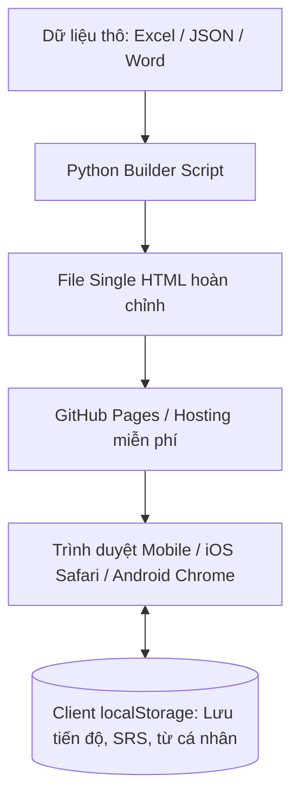
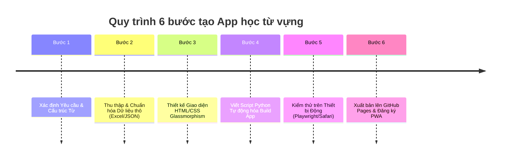

# Quy Trình Thiết Kế & Phát Triển App Học Từ Vựng Đa Ngôn Ngữ (SRS Mobile App Framework)

> **Mục tiêu Framework:** Giúp tạo ra các ứng dụng học từ vựng thông minh (Spaced Repetition System - SRS), giao diện chuẩn Mobile-First (lướt mượt trên iPhone/Android), chạy trực tiếp trên trình duyệt hoặc cài đặt thành Web App (PWA) mà **không cần server phức tạp (Zero-Backend)**, dễ dàng áp dụng cho mọi ngôn ngữ (Tiếng Anh, Tiếng Nhật, Tiếng Hàn, Tiếng Trung, Tiếng Đức...).

---

## 🏗️ 1. Kiến Trúc Tổng Quan Ứng Dụng (App Architecture)



### Các đặc tính cốt lõi:
1. **Single-File HTML & Zero-Backend:** Toàn bộ Giao diện (HTML), Kiểu dáng (CSS Tailwind/Custom), và Logic xử lý (JavaScript) được nhúng gọn trong 1 file `.html`. Học viên mở link là học được ngay, không lo sập server.
2. **Lưu trữ Cục bộ (`localStorage`):** Tiến độ học, ngày đến hạn ôn, số lần nhớ/quên và danh sách từ do người dùng tự nạp đều được lưu trực tiếp trên thiết bị cá nhân.
3. **Build-Automation bằng Python:** Sử dụng script Python đọc từ vựng từ Excel/JSON và tự động "nối" vào template HTML để tạo ra App nhanh chóng trong vài giây.

---

## 📊 2. Cấu Trúc Dữ Liệu Từ Vựng Chuẩn (Universal Data Schema)

Để áp dụng cho nhiều ngôn ngữ khác nhau, mỗi từ vựng được quản lý theo cấu trúc chuẩn JSON sau:

```json
{
  "id": "en_ielts_001",            // ID định danh duy nhất (VD: en_ielts_01, jp_n3_05)
  "word": "Meticulous",             // Từ gốc (Tiếng Anh / Nhật / Hàn / Trung...)
  "phonetic": "/mɪˈtɪkjələs/",       // Phiên âm (IPA cho Tiếng Anh, Pinyin cho Tiếng Trung, Furigana cho Tiếng Nhật)
  "pos": "adj.",                    // Từ loại (Danh từ, Động từ, Tính từ...)
  "meaning": "Tỉ mỉ, kỹ lưỡng",     // Nghĩa tiếng Việt
  "example_target": "She was meticulous about her work.", // Câu ví dụ ngôn ngữ gốc
  "example_vi": "Cô ấy rất tỉ mỉ trong công việc.",       // Dịch nghĩa câu ví dụ
  "tags": ["IELTS Band 7.0", "Academic"],                  // Nhãn phân loại
  "audio": "data:audio/mp3;base64,...",                   // Tệp âm thanh Base64 hoặc URL audio/Web Speech API
  "srs": {                          // Trạng thái thuật toán SRS
    "interval": 1,                  // Khoảng cách ngày ôn tiếp theo
    "repetition": 0,                // Số lần đã ôn đúng liên tiếp
    "easeFactor": 2.5,              // Độ dễ của từ (chuẩn SM-2)
    "dueDate": "2026-10-06"         // Ngày đến hạn ôn tiếp theo (YYYY-MM-DD)
  }
}
```

### Biến thể đặc thù theo từng ngôn ngữ:
- **Tiếng Anh (IELTS / TOEIC):** Thêm trường `collocation` (cụm từ đi kèm), `synonyms` (từ đồng nghĩa), `antonyms` (từ trái nghĩa).
- **Tiếng Nhật (JLPT N5-N1):** Thêm trường `kanji` (Hán tự), `furigana` (Cách đọc Hiragana), `pitch_accent` (Trọng âm phát âm).
- **Tiếng Hàn (TOPIK):** Thêm trường `hanja` (Âm Hán Hàn), `politeness_level` (Kính ngữ/Thân mật).

---

## 🧠 3. Thuật Toán Ôn Tập Lặp Lại Ngắt Quảng (SRS - Spaced Repetition System)

Thuật toán SRS hoạt động dựa trên biểu đồ quên của con người. Mỗi khi học viên lật thẻ flashcard và chọn mức độ nhớ, hệ thống sẽ tự tính toán ngày ôn tiếp theo:

```javascript
// Logic thuật toán SM-2 rút gọn cho Web App
function calculateNextReview(wordSrs, quality) {
  // quality: 1 = Quên (Again), 2 = Khó (Hard), 3 = Tốt (Good), 4 = Dễ (Easy)
  let { interval, repetition, easeFactor } = wordSrs;

  if (quality < 2) { // Quên (Again)
    repetition = 0;
    interval = 1; // Ôn lại vào ngày mai
  } else {
    if (repetition === 0) interval = 1;
    else if (repetition === 1) interval = 3; // Ôn lại sau 3 ngày
    else interval = Math.round(interval * easeFactor);
    repetition += 1;
  }

  // Điều chỉnh hệ số độ dễ (easeFactor)
  easeFactor = easeFactor + (0.1 - (4 - quality) * (0.08 + (4 - quality) * 0.02));
  if (easeFactor < 1.3) easeFactor = 1.3;

  // Tính ngày đến hạn tiếp theo
  const today = new Date();
  today.setDate(today.getDate() + interval);
  const dueDate = today.toISOString().split('T')[0];

  return { interval, repetition, easeFactor, dueDate };
}
```

---

## 📱 4. Thiết Kế Giao Diện 3 Tab Chuẩn Mobile (UI/UX Design)

App được chia làm 3 Tab chính đáp ứng đầy đủ các nhu cầu học tập:

| Tab | Tên Tab | Chức năng chính | Giao diện & Trải nghiệm |
| :--- | :--- | :--- | :--- |
| **Tab 1** | 🎴 **Ôn Tập SRS** | Chỉ hiển thị các từ **đã đến hạn ôn** (`dueDate <= hôm nay`). | Flashcard lật 3D (Mặt trước: Từ + Audio; Mặt sau: Nghĩa + Câu ví dụ + 4 Nút đánh giá SRS). |
| **Tab 2** | 📖 **Sổ Từ Vựng** | Danh sách tra cứu toàn bộ từ trong kho, tìm kiếm & lọc theo bài học. | Bảng/Card danh sách chuẩn, hiển thị ví dụ, nút nghe phát âm, nút Sửa/Xóa. |
| **Tab 3** | ➕ **Thêm Từ Mới** | Form cho người học tự nhập từ vựng cá nhân ngoài giáo trình. | Nhập Từ gốc, Phiên âm, Nghĩa, Ví dụ -> Tự động gắn nhãn `Chị Nạp • Từ Mới`. |

---

## 🛠️ 5. Quy Trình 6 Bước Triển Khai Thực Tế



### 📍 Bước 1: Xác định Yêu cầu & Cấu trúc Từ
- Chọn ngôn ngữ mục tiêu (Anh, Nhật, Hàn, Pháp...).
- Xác định các thông tin bắt buộc phải hiển thị (Phiên âm, Từ loại, Phát âm, Câu ví dụ, Chiết tự Hán tự...).

### 📍 Bước 2: Thu thập & Chuẩn hóa Dữ liệu (Data Engineering)
- Nhập từ vựng vào file Excel/CSV hoặc file JSON thô.
- Chuẩn hóa cột: `word`, `phonetic`, `meaning`, `example_target`, `example_vi`, `tags`.

### 📍 Bước 3: Xây dựng Template Giao diện (HTML/TailwindCSS/JS)
- Thiết kế layout Mobile-First tương thích kích thước màn hình điện thoại (iPhone, Samsung...).
- Tích hợp hiệu ứng lật thẻ 3D bằng CSS (`transform-style: preserve-3d`).
- Viết hàm `loadAppState()` và `saveAppState()` để đồng bộ với `localStorage`.

### 📍 Bước 4: Viết Python Script Tự động hóa Build App (`build_app.py`)
- Script Python đọc file dữ liệu từ vựng (Excel/JSON/Word).
- Tự động chuyển đổi âm thanh MP3/M4A thành dạng chuỗi nén Base64 (hoặc Web Speech API để tự động đọc không cần file âm thanh).
- Render dữ liệu vào Template HTML và xuất ra file `index.html` duy nhất.

### 📍 Bước 5: Kiểm thử Giao diện & Logic (QA Testing)
- Kiểm tra tính năng lật thẻ, chấm điểm SRS, lọc từ vựng.
- Kiểm tra hiển thị trên điện thoại (đảm bảo không bị lấn lề, tràn khung hay rò rỉ thanh cuộn).

### 📍 Bước 6: Xuất bản (Deployment & PWA)
- Đẩy file `index.html` lên repository GitHub Pages (`https://username.github.io/app-name/`).
- Tạo file `manifest.json` và `sw.js` (Service Worker) để cho phép người dùng **"Thêm vào màn hình chính" (Add to Home Screen)** trên iPhone/Android như một app di động native.

---

## 💡 6. Mở Rộng Cho Các Yêu Cầu Tùy Biến Khác

### 1. Tự động phát âm không cần file âm thanh (Web Speech API):
Thay vì phải tải/thu âm file `.mp3`, có thể dùng tính năng đọc tự động có sẵn của điện thoại:
```javascript
function speakWord(text, lang = 'en-US') {
  // lang: 'en-US' (Anh), 'ja-JP' (Nhật), 'ko-KR' (Hàn), 'zh-CN' (Trung), 'fr-FR' (Pháp)
  const utterance = new SpeechSynthesisUtterance(text);
  utterance.lang = lang;
  utterance.rate = 0.9; // Tốc độ đọc
  window.speechSynthesis.speak(utterance);
}
```

### 2. Tích hợp các dạng bài tập tương tác bổ trợ:
- **Bài tập Trắc nghiệm (Multiple Choice Quiz):** Cho từ gốc, chọn 1 trong 4 đáp án nghĩa tiếng Việt.
- **Bài tập Điền từ / Gõ từ (Spelling Quiz):** Cho nghĩa + audio, yêu cầu gõ lại đúng từ gốc.
- **Game Ghép cặp (Matching Game):** Trò chơi nối từ gốc với nghĩa tiếng Việt tương ứng trong thời gian quy định.

### 3. Đồng bộ dữ liệu đám mây (Cloud Sync optional):
- Nếu muốn đồng bộ giữa máy tính và điện thoại, có thể kết nối với **Google Sheets API** hoặc **Firebase Firestore** làm cơ sở dữ liệu lưu tiến độ thay vì chỉ lưu `localStorage`.
